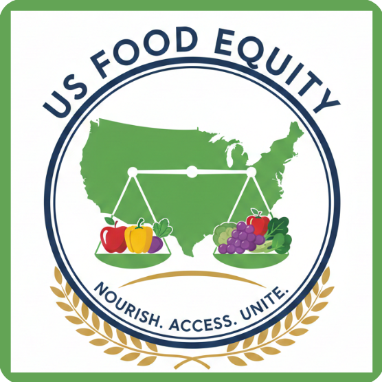

<p align="left">
  
</p>

## US_FoodScope

*US_FoodScope* is a comprehensive data analytics and machine learning platform designed to analyze the complex relationship between *food environment*, *socioeconomic factors*, and *health outcomes* in the United States.

It combines *predictive modeling* with *interactive tools* to provide actionable insights into food security, obesity, and diabetes trends across different regions.

---

## 🚀 Features

### 🤖 Machine Learning Modules
- **Health Predictions**: Random Forest models to forecast *Adult Obesity* and *Diabetes* rates.
- **Risk Analysis**: Integration of various risk factors including poverty rates, food access, and physical activity access.
- **Interactive Forms**: Dynamic prediction interface with real-time history tracking and data reuse.
- **Confidence Intervals**: Statistical confidence estimation for all predictions to ensure reliability.
- **RAG Chatbot**: AI-powered assistant utilizing Retrieval-Augmented Generation to answer user queries about food environment data and health trends.

### 📊 Analytics & Insights
- **Food Security**: Analysis of food insecurity trends (Child Food Insecurity, Very Low Food Security).
- **Food Environment**: Metrics on farmers' markets availability, grocery prices (Milk/Soda ratio), and physical activity access (Gyms per 1000).
- **Socioeconomic Impact**: Correlation of median income, poverty rates, and demographics with health outcomes.

### 🧑‍💼 User Experience
- **Role-Based Dashboard**: Secure authentication and personalized dashboards.
- **Prediction History**: Automatically saves predictions for future reference and comparison.
- **Responsive Design**: Clean, accessible interface for professionals and researchers.

---

## 🧩 System Architecture

| Component | Description |
|---------|-------------|
| *Frontend* | HTML5, CSS3, JavaScript (Vanilla) |
| *Backend* | Django 5.2 |
| *Machine Learning* | Scikit-Learn, NumPy, Joblib |
| *Database* | SQLite (Dev) / PostgreSQL (Prod ready) |
| *ML Encoders* | Joblib-serialized encoders & scalers |
| *Architecture* | Modular Django Apps (Health, Users, Dashboard, Insecurity) |

---

## 🛠️ Installation & Setup

### 1. Clone the Repository

```bash
git clone https://github.com/ESEdamHakim/US_FoodScope.git
cd US_FoodScope
```

### 2. Create a Virtual Environment

*On Windows:*
```bash
python -m venv env
.\env\Scripts\activate
```

*On macOS/Linux:*
```bash
python3 -m venv env
source env/bin/activate
```

### 3. Install Dependencies

```bash
cd us_foodscope
pip install -r requirements.txt
```

### 4. Run the Development Server

```bash
python manage.py runserver
```

The application will be available at [http://127.0.0.1:8000/](http://127.0.0.1:8000/)
